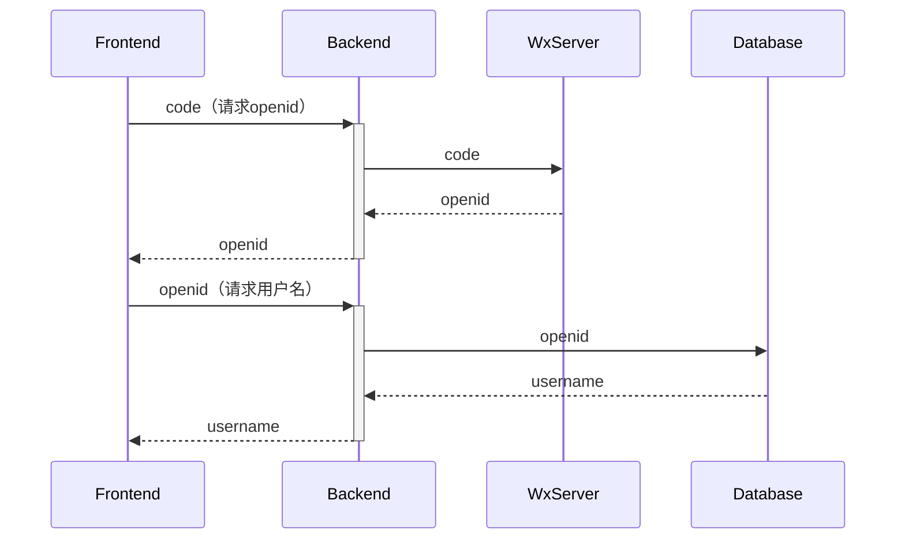

# 简单微信公众号获取openid示例

## feature
通过微信浏览器平台，可以请求到用户的openid。再通过openid，对数据增删改查

## 一个典型的请求流程

```mermaid
sequenceDiagram
    participant Frontend
    participant Backend
    participant WxServer
    participant Database
    Frontend->>+Backend: code（请求openid）
    Backend->>WxServer:code
    WxServer-->>Backend:openid
    Backend-->>-Frontend: openid

    Frontend->>+Backend: openid（请求用户名）
    Backend->>Database: openid
    Database-->>Backend: username
    Backend-->>-Frontend: username

```

## 部署
通过`s`工具，自动通过faas的形式部署到阿里云

## Tips
由于code只能使用一次并且有效期5分钟，为了便于调试，写了show.html，会显示查询参数，方便使用浏览器调试
